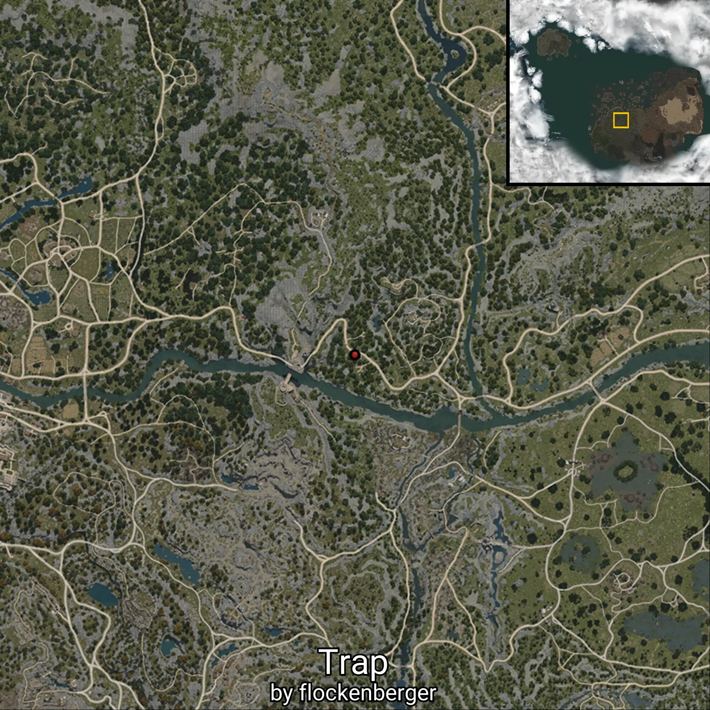
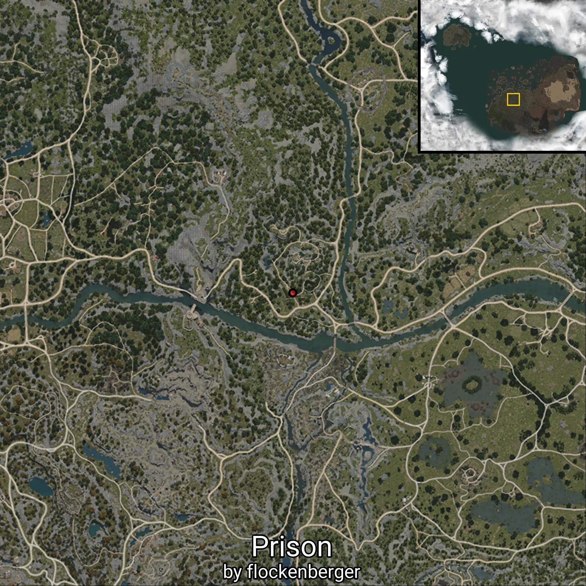

# Bandits
Created by **flockenberger**

## ⚠️ Disclaimer:
The `WorldmapBookMark` XML block below may contain **more than 5 waypoints**.

**Please note that Black Desert Online only supports importing up to 5 waypoints at a time**.

Before importing, check and adjust which waypoints you want to use to avoid errors or missing data.

The waypoints are generated based on positions found in the client files and may not correspond to actual knowledge entries obtainable through NPC interactions.
They may instead point to locations such as mobs (monsters) or other entities that need to be defeated in order to gain knowledge.

## Waypoints
```xml
<!--
    Waypoints for: Bandits
    Created by: flockenberger
-->
<WorldmapBookMark>
    <BookMark BookMarkName="Demibeast Bandit Warrior" PosX="-95099.0703125" PosY="770.7899780273438" PosZ="-16486.400390625" />
    <BookMark BookMarkName="Bandit Defense Captain" PosX="-101038.03125" PosY="1090.02001953125" PosZ="-15759.0" />
    <BookMark BookMarkName="Bandit Raid Captain" PosX="-111084.0234375" PosY="-629.1599731445312" PosZ="-43524.58984375" />
    <BookMark BookMarkName="Giant Bandit" PosX="-91632.3671875" PosY="880.6500244140625" PosZ="-29063.890625" />
    <BookMark BookMarkName="Bandit Archer" PosX="-83653.28125" PosY="-1610.06005859375" PosZ="-38055.98828125" />
    <BookMark BookMarkName="Bandit Warrior" PosX="-87960.1875" PosY="-2688.909912109375" PosZ="-50518.80078125" />
    <BookMark BookMarkName="Trap" PosX="-111327.0234375" PosY="-515.3400268554688" PosZ="-42462.08984375" />
    <BookMark BookMarkName="Briar Lightning Trap" PosX="-103999.0" PosY="-1892.8199462890625" PosZ="-49882.8984375" />
    <BookMark BookMarkName="Log Lightning Trap" PosX="-84967.6875" PosY="-1896.739990234375" PosZ="-41139.08984375" />
    <BookMark BookMarkName="Trained Wolf" PosX="-116314.0234375" PosY="-101.5199966430664" PosZ="-40774.48828125" />
    <BookMark BookMarkName="Bandit Round Hut" PosX="-96483.46875" PosY="844.2999877929688" PosZ="-16075.990234375" />
    <BookMark BookMarkName="Bandit Hut" PosX="-99137.796875" PosY="961.8300170898438" PosZ="-18923.91015625" />
    <BookMark BookMarkName="Bandit Amulet" PosX="-97728.7890625" PosY="899.010009765625" PosZ="-19669.890625" />
    <BookMark BookMarkName="Bandit Watchtower" PosX="-93761.1015625" PosY="-1311.0" PosZ="-21864.400390625" />
    <BookMark BookMarkName="Bandit Large Watchtower" PosX="-102316.0" PosY="1324.02001953125" PosZ="-13984.2998046875" />
    <BookMark BookMarkName="Prison" PosX="-92507.296875" PosY="-2720.719970703125" PosZ="-44198.98046875" />
    <BookMark BookMarkName="Bandit Treasure Chest" PosX="-103102.0234375" PosY="1261.06005859375" PosZ="-16123.6904296875" />
    <BookMark BookMarkName="Bandit Treasure Wagon" PosX="-102300.0" PosY="1239.3599853515625" PosZ="-15057.2001953125" />
</WorldmapBookMark>
```

                  