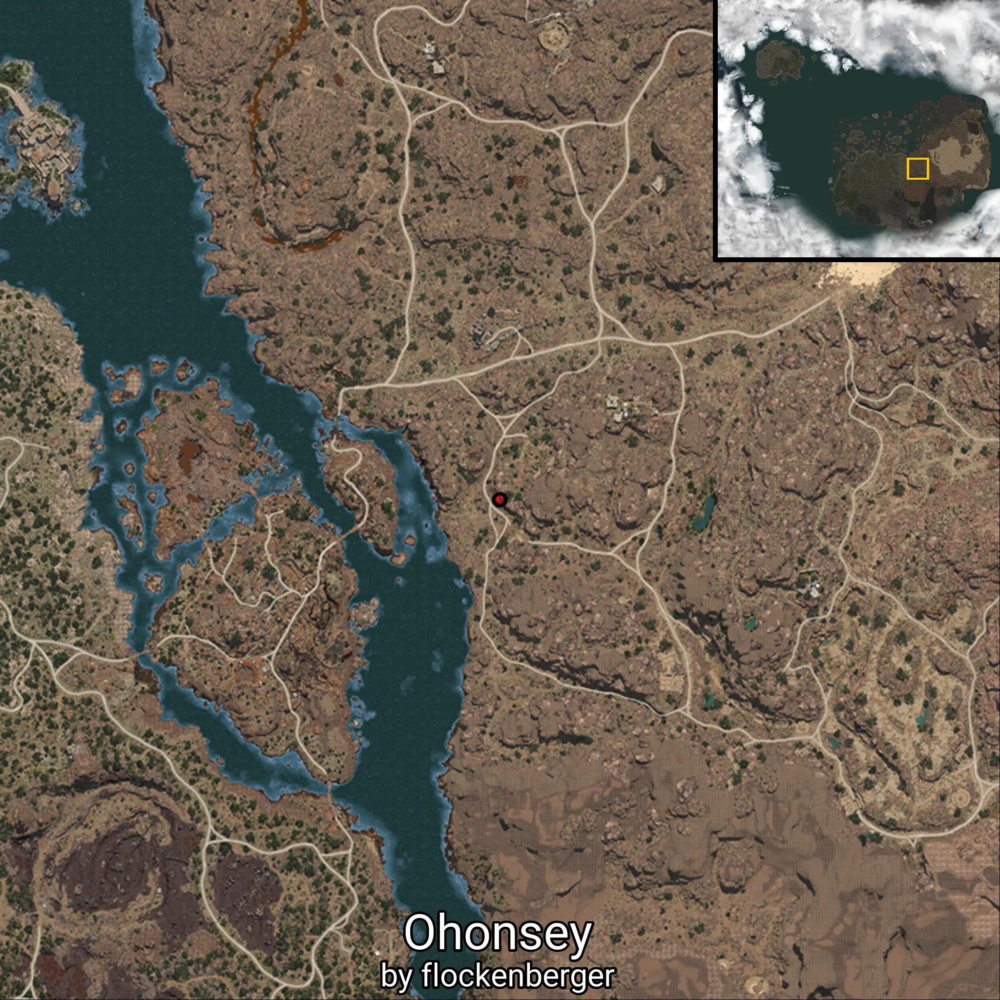

# Bashim

This folder contains 14/14 waypoints of this knowledge category!


Created by **flockenberger**

## ⚠️ Disclaimer:
The `WorldmapBookMark` XML block below may contain **more than 5 waypoints**.

**Please note that Black Desert Online only supports importing up to 5 waypoints at a time**.

Before importing, check and adjust which waypoints you want to use to avoid errors or missing data.

The waypoints are generated based on positions found in the client files and may not correspond to actual knowledge entries obtainable through NPC interactions.
They may instead point to locations such as mobs (monsters) or other entities that need to be defeated in order to gain knowledge.

## Waypoints
```xml
<!--
    Waypoints for: Bashim
    Created by: flockenberger
-->
<WorldmapBookMark>
    <BookMark BookMarkName="Khala Reinforced Thrower" PosX="425404.0" PosY="-5589.60986328125" PosZ="-39095.80078125" />
    <BookMark BookMarkName="Khala Commanding Officer" PosX="420200.0" PosY="-3121.300048828125" PosZ="-60642.3984375" />
    <BookMark BookMarkName="Khala Elite Combatant" PosX="414924.0" PosY="-4480.25" PosZ="-46386.1015625" />
    <BookMark BookMarkName="Terruda Bandsman" PosX="415295.0" PosY="-5650.56005859375" PosZ="-33836.8984375" />
    <BookMark BookMarkName="Terruda Reinforced Infantryman" PosX="497277.0" PosY="-3205.929931640625" PosZ="-89799.8828125" />
    <BookMark BookMarkName="Terruda Thrower" PosX="414119.0" PosY="-5675.72021484375" PosZ="-34074.0" />
    <BookMark BookMarkName="Terruda Infantryman" PosX="424673.0" PosY="-5557.2001953125" PosZ="-38897.30078125" />
    <BookMark BookMarkName="Ohonsey Elementalist" PosX="421909.0" PosY="-4433.509765625" PosZ="-71230.796875" />
    <BookMark BookMarkName="Ohonsey Archer" PosX="416935.0" PosY="-5529.8798828125" PosZ="-35822.19921875" />
    <BookMark BookMarkName="Ohonsey" PosX="422682.0" PosY="-5418.64013671875" PosZ="-32464.5" />
    <BookMark BookMarkName="Bashim Target Totem" PosX="472831.0" PosY="-4020.56005859375" PosZ="-71330.5" />
    <BookMark BookMarkName="Bashim Extermination Totem" PosX="468500.0" PosY="-2237.300048828125" PosZ="-61696.80078125" />
    <BookMark BookMarkName="Bashim Guard Totem" PosX="456911.0" PosY="-2342.840087890625" PosZ="-87150.6015625" />
    <BookMark BookMarkName="Bashim Energy Totem" PosX="458403.0" PosY="-1331.1600341796875" PosZ="-60318.6015625" />
</WorldmapBookMark>
```

              