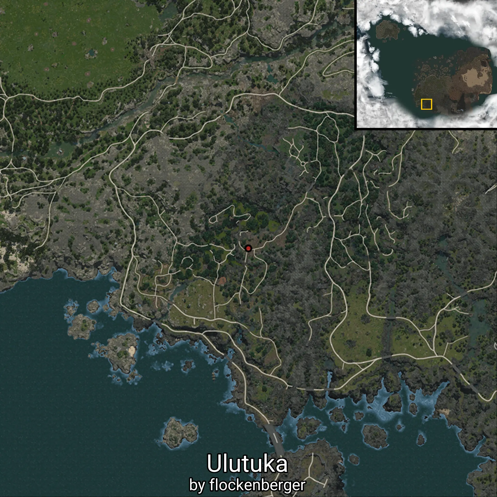
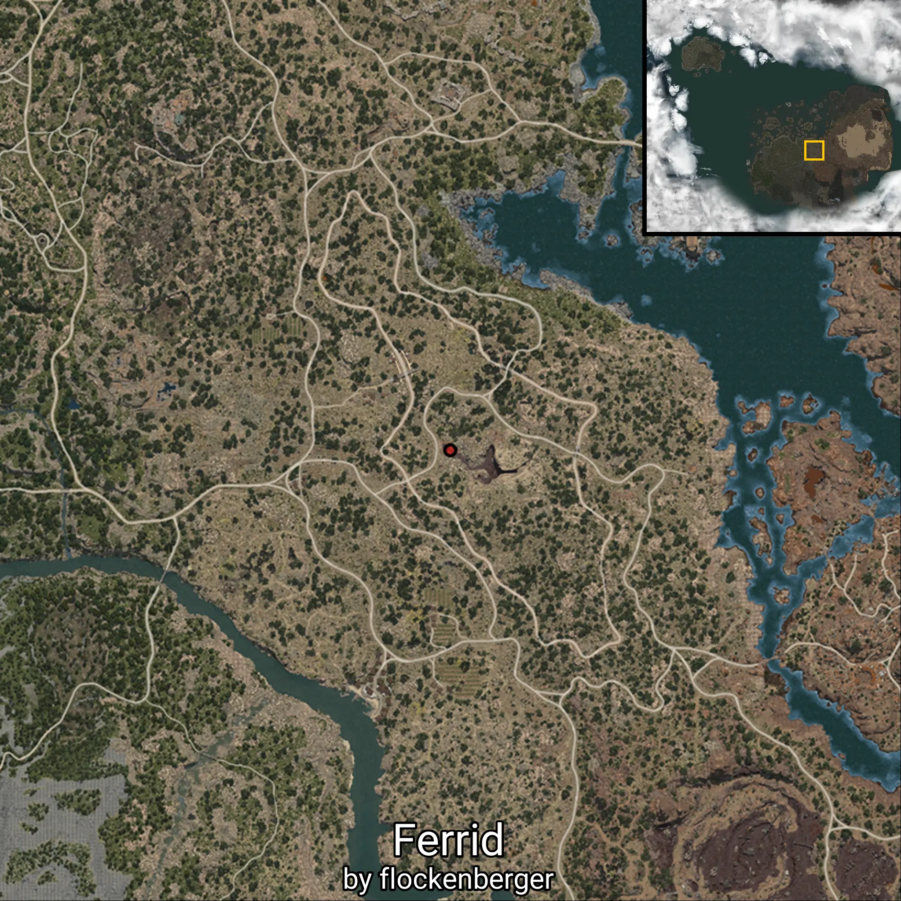

# Bosses

This folder contains 45/82 waypoints of this knowledge category!

The following knowledge entries are currently missing: 

```
Caphras
```

```
Cartian
```

```
Rusalka
```

```
Enslar
```

```
Jordine
```

```
Rawr-Rawr
```

```
Khan
```

```
Go Young
```

```
Master
```

```
Dark Bonghwang
```

```
Janghwa and Hongryeon
```

```
Jigwi
```

```
Blue-clad Youth
```

```
Bihyung
```

```
Samsin
```

```
Golden Marten
```

```
Imoogi
```

```
Lee Duksoo, Yeongam of the East
```

```
Jang Iksoon, Hyungam of Dalbeol
```

```
Oduksini
```

```
Apex Changui
```

```
Geuseunsae
```

```
Bamboo Legion
```

```
Duoksini
```

```
Songakshi
```

```
Gumiho
```

```
Mudang Wraith
```

```
Incarnation of Corruption
```

```
Olun's Silence
```

```
Raz'nal
```

```
Fallen Ataraxia
```

```
Saigord
```

```
Katzvariak
```

```
Hexe Marie
```

```
Ahib Griffon
```

```
Black Shadow
```

```
Erebjork, the Dreadwinter Guardian
```


Created by **flockenberger**

## ⚠️ Disclaimer:
The `WorldmapBookMark` XML block below may contain **more than 5 waypoints**.

**Please note that Black Desert Online only supports importing up to 5 waypoints at a time**.

Before importing, check and adjust which waypoints you want to use to avoid errors or missing data.

The waypoints are generated based on positions found in the client files and may not correspond to actual knowledge entries obtainable through NPC interactions.
They may instead point to locations such as mobs (monsters) or other entities that need to be defeated in order to gain knowledge.

## Waypoints
```xml
<!--
    Waypoints for: Bosses
    Created by: flockenberger
-->
<WorldmapBookMark>
    <BookMark BookMarkName="Vell" PosX="-103396.0" PosY="-8150.0" PosZ="947221.0" />
    <BookMark BookMarkName="Uturi" PosX="-1267540.0" PosY="-1655.5999755859375" PosZ="1513120.0" />
    <BookMark BookMarkName="Bulgasal" PosX="-1518680.0" PosY="7407.60009765625" PosZ="1153610.0" />
    <BookMark BookMarkName="Sangoon" PosX="-1159960.0" PosY="12631.0" PosZ="1332940.0" />
    <BookMark BookMarkName="Golden Pig King" PosX="-1147270.0" PosY="-2600.0" PosZ="1183690.0" />
    <BookMark BookMarkName="The Phantom Knight of Bartali III" PosX="9925.0" PosY="4525.0" PosZ="123525.0" />
    <BookMark BookMarkName="Ulutuka" PosX="-313524.1875" PosY="5024.10009765625" PosZ="-539782.5" />
    <BookMark BookMarkName="Garmoth" PosX="-21895.0" PosY="9175.0" PosZ="-323325.0" />
    <BookMark BookMarkName="Leebur" PosX="-43272.80078125" PosY="26464.0" PosZ="-409358.0" />
    <BookMark BookMarkName="Reanimated Ancient Puturum" PosX="490115.59375" PosY="10922.099609375" PosZ="229003.59375" />
    <BookMark BookMarkName="Monarch of Darkness, Belmorn" PosX="-364572.0" PosY="-7860.4501953125" PosZ="40382.80078125" />
    <BookMark BookMarkName="Helm Tribe Chief Steel Nux" PosX="113297.0" PosY="969.3800048828125" PosZ="64869.19921875" />
    <BookMark BookMarkName="Black Mane" PosX="-235717.0" PosY="4862.27978515625" PosZ="-76805.3984375" />
    <BookMark BookMarkName="Urugon" PosX="-558904.375" PosY="-542000.5" PosZ="-7148.2236328125" />
    <BookMark BookMarkName="Ronin" PosX="-486673.0" PosY="2745.239990234375" PosZ="-447905.0" />
    <BookMark BookMarkName="Mirumok Destroyer Offin" PosX="-362849.0" PosY="6029.419921875" PosZ="-445048.0" />
    <BookMark BookMarkName="Muraka" PosX="-400988.0" PosY="9106.4599609375" PosZ="-106137.0" />
    <BookMark BookMarkName="Quint" PosX="-334826.0" PosY="-80.41609954833984" PosZ="14977.2998046875" />
    <BookMark BookMarkName="Watcher Offin Tett" PosX="-451317.59375" PosY="16415.400390625" PosZ="-329280.8125" />
    <BookMark BookMarkName="Mirumok Watcher Offin" PosX="-453648.0" PosY="16315.400390625" PosZ="-331170.0" />
    <BookMark BookMarkName="Narc Brishka" PosX="-486673.0" PosY="2745.239990234375" PosZ="-447905.0" />
    <BookMark BookMarkName="Nouver" PosX="729882.0" PosY="11642.7001953125" PosZ="4070.7099609375" />
    <BookMark BookMarkName="Agrakhan" PosX="442035.0" PosY="3640.2900390625" PosZ="88245.1015625" />
    <BookMark BookMarkName="Ferrid" PosX="246557.0" PosY="-5334.0498046875" PosZ="-12953.599609375" />
    <BookMark BookMarkName="Biraghi" PosX="-235717.0" PosY="4862.27978515625" PosZ="-76805.3984375" />
    <BookMark BookMarkName="Gehaku" PosX="-125704.0" PosY="3307.52001953125" PosZ="-234686.0" />
    <BookMark BookMarkName="Org" PosX="-88870.8828125" PosY="-2818.550048828125" PosZ="-71725.6875" />
    <BookMark BookMarkName="Giant Mudster" PosX="31215.5" PosY="370.29998779296875" PosZ="-111257.0" />
    <BookMark BookMarkName="Al Rhundi" PosX="98167.703125" PosY="2086.81005859375" PosZ="-116905.0" />
    <BookMark BookMarkName="Muskan" PosX="-34027.2109375" PosY="3601.6298828125" PosZ="-170347.984375" />
    <BookMark BookMarkName="Titium" PosX="14669.2001953125" PosY="-2005.8299560546875" PosZ="-123789.0" />
    <BookMark BookMarkName="Dastard Bheg" PosX="-43663.30078125" PosY="-1840.0400390625" PosZ="-41496.19140625" />
    <BookMark BookMarkName="Queen Stoneback Crab" PosX="-107934.0234375" PosY="5267.72021484375" PosZ="-124127.0" />
    <BookMark BookMarkName="Mad Scientist's Assistant" PosX="-235717.0" PosY="4862.27978515625" PosZ="-76805.3984375" />
    <BookMark BookMarkName="Root Nymph King" PosX="-316795.0" PosY="10600.0" PosZ="-280427.96875" />
    <BookMark BookMarkName="Kelcas" PosX="-235717.0" PosY="4862.27978515625" PosZ="-76805.3984375" />
    <BookMark BookMarkName="Ruins Guard Tower" PosX="-217565.03125" PosY="-1855.5799560546875" PosZ="53557.01171875" />
    <BookMark BookMarkName="Ancient Kutum" PosX="529070.0" PosY="5844.0498046875" PosZ="162162.0" />
    <BookMark BookMarkName="Moghulis" PosX="124627.0" PosY="9762.23046875" PosZ="30332.69921875" />
    <BookMark BookMarkName="Saunil Siege Captain" PosX="-265601.0" PosY="-1055.1600341796875" PosZ="-62938.80078125" />
    <BookMark BookMarkName="Karanda" PosX="-142451.0" PosY="18933.80078125" PosZ="48297.30078125" />
    <BookMark BookMarkName="Red Nose" PosX="-52577.5" PosY="-1053.1500244140625" PosZ="84767.59375" />
    <BookMark BookMarkName="Dim Tree Spirit" PosX="-49751.91015625" PosY="-4264.22998046875" PosZ="26021.609375" />
    <BookMark BookMarkName="Giath" PosX="69083.5" PosY="-6241.31982421875" PosZ="43941.08984375" />
    <BookMark BookMarkName="Vercedes" PosX="50445.69921875" PosY="26583.099609375" PosZ="-534233.0" />
</WorldmapBookMark>
```

                                             