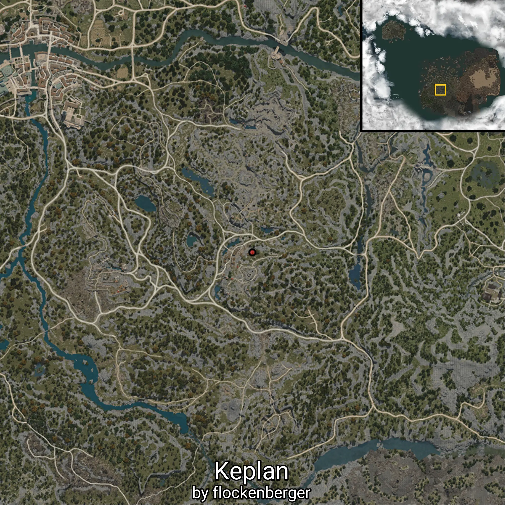

# Keplan
Created by **flockenberger**

## ⚠️ Disclaimer:
The `WorldmapBookMark` XML block below may contain **more than 5 waypoints**.

**Please note that Black Desert Online only supports importing up to 5 waypoints at a time**.

Before importing, check and adjust which waypoints you want to use to avoid errors or missing data.

The waypoints are generated based on positions found in the client files and may not correspond to actual knowledge entries obtainable through NPC interactions.
They may instead point to locations such as mobs (monsters) or other entities that need to be defeated in order to gain knowledge.

## Waypoints
```xml
<!--
    Waypoints for: Keplan
    Created by: flockenberger
-->
<WorldmapBookMark>
    <BookMark BookMarkName="Keplan" PosX="-146550.0" PosY="2925.570068359375" PosZ="-149529.0" />
    <BookMark BookMarkName="Tarte Rock Fork" PosX="-190545.0" PosY="-2917.1201171875" PosZ="-162334.0" />
    <BookMark BookMarkName="Dane Canyon" PosX="-189926.0" PosY="1423.5" PosZ="-202732.0" />
    <BookMark BookMarkName="Oze's House" PosX="-149062.0" PosY="5238.3701171875" PosZ="-105825.0" />
    <BookMark BookMarkName="Quarry Byway" PosX="-121620.0" PosY="1311.4599609375" PosZ="-111726.0" />
    <BookMark BookMarkName="Glutoni Cave" PosX="-174138.0" PosY="-1104.760009765625" PosZ="-145028.0" />
    <BookMark BookMarkName="Serendia Western Gateway" PosX="-96355.0" PosY="1869.1500244140625" PosZ="-176582.0" />
    <BookMark BookMarkName="Gianin Farm" PosX="-119990.0" PosY="3234.31005859375" PosZ="-177235.0" />
    <BookMark BookMarkName="Keplan Vicinity" PosX="-122183.0" PosY="974.6829833984375" PosZ="-142498.0" />
    <BookMark BookMarkName="Gehaku Plain" PosX="-135029.0" PosY="3622.030029296875" PosZ="-205931.0" />
    <BookMark BookMarkName="Abandoned Quarry" PosX="-157926.0" PosY="-1091.06005859375" PosZ="-185247.0" />
    <BookMark BookMarkName="Beacon Entrance Post" PosX="-215522.0" PosY="6.865900039672852" PosZ="-132103.0" />
    <BookMark BookMarkName="Saunil Camp" PosX="-213306.0" PosY="-7.8805999755859375" PosZ="-188911.0" />
    <BookMark BookMarkName="Keplan Hill" PosX="-149597.0" PosY="5202.97998046875" PosZ="-167071.0" />
    <BookMark BookMarkName="Marni Farm Ruins" PosX="-165392.0" PosY="-277.73699951171875" PosZ="-83109.8984375" />
    <BookMark BookMarkName="Oze Pass" PosX="-133846.0" PosY="6556.08984375" PosZ="-76098.703125" />
    <BookMark BookMarkName="Oberen Farm" PosX="-230592.0" PosY="-784.6179809570312" PosZ="-112313.0" />
    <BookMark BookMarkName="North Abandoned Quarry" PosX="-151713.0" PosY="2243.840087890625" PosZ="-123186.0" />
    <BookMark BookMarkName="Bain Farmland" PosX="-247841.0" PosY="-1168.0400390625" PosZ="-137715.0" />
    <BookMark BookMarkName="Hexe Stone Wall" PosX="-174251.0" PosY="3288.169921875" PosZ="-244159.0" />
    <BookMark BookMarkName="Falres Dirt Farm" PosX="-199155.0" PosY="-2762.159912109375" PosZ="-61302.30078125" />
    <BookMark BookMarkName="Marni's Lab" PosX="-188416.0" PosY="6830.89990234375" PosZ="-124974.0" />
    <BookMark BookMarkName="Trina Beacon Towers" PosX="-227992.0" PosY="8043.009765625" PosZ="-142135.0" />
    <BookMark BookMarkName="Trina Fort" PosX="-222484.0" PosY="2977.989990234375" PosZ="-157273.0" />
    <BookMark BookMarkName="Saunil Battlefield" PosX="-245714.0" PosY="-890.3319702148438" PosZ="-187127.0" />
    <BookMark BookMarkName="Primal Giant Post" PosX="-125594.0" PosY="3306.2900390625" PosZ="-236177.0" />
</WorldmapBookMark>
```

                          