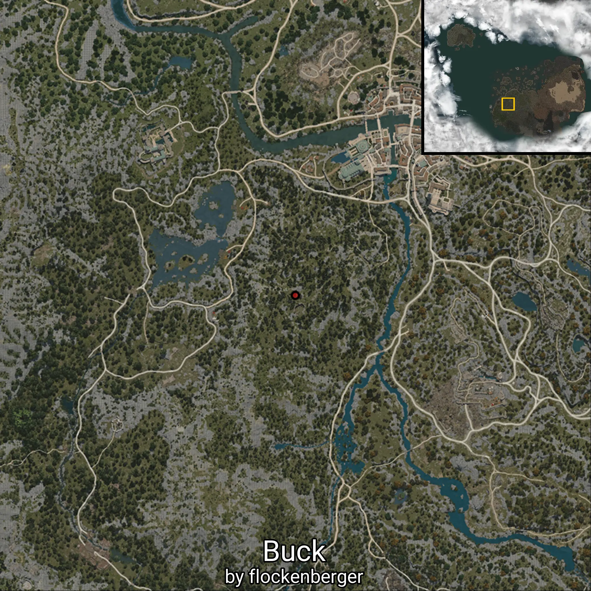

# None

This folder contains 66/301 waypoints of this knowledge category!

The following knowledge entries are currently missing: 

```
UNKNOWN
```

```
UNKNOWN
```

```
UNKNOWN
```

```
UNKNOWN
```

```
UNKNOWN
```

```
UNKNOWN
```

```
UNKNOWN
```

```
UNKNOWN
```

```
UNKNOWN
```

```
UNKNOWN
```

```
UNKNOWN
```

```
UNKNOWN
```

```
Grass Skirt
```

```
Buy House
```

```
Acacia Plywood Hardener
```

```
White Cedar Plywood Hardener
```

```
Elder Tree Sap
```

```
Introduction to Quiz
```

```
Crisis of Iliya Island
```

```
Iliya Island Altar
```

```
A Letter from a Soldier
```

```
Mysterious Khuruto Rock
```

```
Lavientia's Treasure
```

```
Types of Expeditions
```

```
Valkyrie's Treasure
```

```
Geoffrey's Solitude
```

```
Dias Farm's Daughter
```

```
Psychological Warfare V
```

```
Psychological Warfare IV
```

```
Psychological Warfare III
```

```
Valkyrie Textbook
```

```
Workshop District
```

```
Sanctuary of Aristocrats
```

```
Ostracizing Alchemy
```

```
Kaiapere Banquet Hall
```

```
Grand Ritual
```

```
The Great Library of Calpheon
```

```
History of Calpheon Education
```

```
Wine War
```

```
Triple Cropping
```

```
Life of the Ancients
```

```
Safe Trip
```

```
Introduction to Happiness
```

```
World of Philosophy
```

```
Reflection
```

```
Life is Precious
```

```
The Great Move of the Fogans
```

```
Youth Must Be Served
```

```
Wagon Wheel Hinge
```

```
Value of a Fairy
```

```
Primitive Giant Funeral Custom
```

```
Primitive Giant Custom
```

```
Artifacts from Ancient Temple
```

```
Goblin Prince
```

```
Stonetail Bison
```

```
Stonetail Bison
```

```
Mediah Stoneback Crab 5
```

```
Mediah Stoneback Crab 4
```

```
Mediah Stoneback Crab 3
```

```
Mediah Stoneback Crab 2
```

```
Swamp Spider Cave
```

```
Hexe Sanctuary Stone Grave
```

```
Mediah Rebel Captain
```

```
Mediah Rebel Commander
```

```
Lava Chief
```

```
Sandwich Stoneback Crab
```

```
Grudge of the Shadow Knights Master
```

```
Bree Tree Ruins Guard Tower
```

```
Calpheon Shrine Wizard
```

```
Ballista
```

```
Arrow
```

```
Box
```

```
Collapsed Rocks
```

```
Troll Barricade
```

```
Stable_1
```

```
Stable
```

```
Damaged Handcart
```

```
Elite Shadow Priestess
```

```
Elite Shadow Knight
```

```
Lapis Lazuli Margos
```

```
Tutuka
```

```
Contaminated Manager
```

```
Black Spirit
```

```
Black Spirit
```

```
Black Spirit
```

```
Contaminated Bear
```

```
Party Leader
```

```
Ancient Ruins Stone Tree
```

```
Ancient Ruins Raptor
```

```
Cheetah Dragon
```

```
Balloon Pig
```

```
Stone Tree
```

```
Ruins Raptor
```

```
Primitive Orc
```

```
Witmirth
```

```
Witch
```

```
Treant 1
```

```
Treant
```

```
Catfishman Elite Archer
```

```
Catfishman Elite Warrior
```

```
Catfishman Spearman
```

```
Catfishman Warrior
```

```
Ruins Guard Possessed by a Black Spirit
```

```
Skeleton Warrior Possessed by a Black Spirit
```

```
Archer Possessed by a Black Spirit
```

```
Primitive Orc Archer
```

```
Primitive Orc Wizard
```

```
Primitive Orc Warrior
```

```
Wandering Wheat Field Lookout
```

```
Wandering Scarecrow Ghost
```

```
Premature Pumpkin Ghost
```

```
Young Sloth
```

```
Young Stonescale Devourer
```

```
Graveyard Witmirth
```

```
Demibeast Bandit Wizard
```

```
Khuruto 7
```

```
Khuruto 6
```

```
Mole Worm
```

```
Lizard Elite Soldier
```

```
Lizard Archer
```

```
Lizard Warrior
```

```
Lizard Defender
```

```
Tree Guenon
```

```
Guenon
```

```
Giant Wizard
```

```
Dagon Elite Warrior
```

```
Dagon Wizard
```

```
Diseased Cow
```

```
Straggler Wizard
```

```
Straggler Archer
```

```
Straggler Warrior
```

```
Straggler
```

```
Ostracized Worker
```

```
Siege Lizard
```

```
Dwarf Bandit Elite Warrior
```

```
Dwarf Bandit Archer
```

```
Dwarf Bandit Warrior
```

```
Red Feather Devourer
```

```
Naga Trainer
```

```
Tiny Golem
```

```
Dagon Warrior
```

```
Dagon
```

```
Calpheon Stoneback Crab
```

```
Failed Orc Test Subject
```

```
Mad Screaming Orc
```

```
Sloth
```

```
Giant Dinosaur
```

```
Giant Insect
```

```
Mad Scientist's Assistant
```

```
Demibeast Bandit Archer
```

```
Red Orc Fighter
```

```
Orc Mushroom
```

```
Giant Weasel
```

```
Ballista Impact
```

```
Wagon Impact
```

```
Multiple Firing Wagon
```

```
Arena Bamboo Spear
```

```
Khuruto Food Depot
```

```
Rhutum Barricade
```

```
Cobweb 2
```

```
Mediah Giant Rogue
```

```
Demibeast Bandsman
```

```
Demibeast Super Warrior
```

```
Demibeast Warrior
```

```
Mediah Monk Giant
```

```
Mediah Monk Assassin
```

```
Mediah Monk Wizard
```

```
Mediah Monk
```

```
Demibeast Wizard
```

```
Demibeast Archer
```

```
Demibeast
```

```
Cultist Elite Knight
```

```
Chimera
```

```
Demibeast Chief Warrior
```

```
Dead Iguana
```

```
Dead Rhino Lizard
```

```
Shepherd
```

```
Horn Chimera (Not in Use)
```

```
Giant Bee
```

```
Quarry Summoning Tower  
```

```
Giant Watchtower
```

```
Petrified Laborer's Captain
```

```
Faust Forest Giant Stoneback Crab
```

```
Ruins Tree
```

```
Troll Ration Depot 2
```

```
Calpheon Protester Archer
```

```
Harpy Nest
```

```
Young Treant
```

```
Demibeast Bandit Warrior Chief
```

```
Naga Captain
```

```
Naga Commander
```

```
Naga Combat Instructor
```

```
Naga Combat Axeman
```

```
Mine Imp Defense Tower
```

```
Naga Altar
```

```
Demibeast Bandit Elite Warrior
```

```
Contaminated Villager 2
```

```
Contaminated Villager 1
```

```
Ancient Troll Porter
```

```
Demibeast Possessed by a Black Spirit
```

```
Naga Apprentice Axeman
```

```
Naga Apprentice Spearman
```

```
Naga Combat Spearman
```

```
Naga Trainer
```

```
Ruins Stone Tree
```

```
Sorcerer
```

```
Dragon
```

```
Ancient Ruins Guardian
```

```
Skeleton King
```

```
Gargoyle
```

```
Ranged Ruins Golem
```

```
Medium Ruins Golem
```

```
Bison
```

```
Longtail Salamander
```

```
Serendia Shrine Assassin
```

```
Bulltrim Worm
```

```
Shadow Priest
```

```
Cox Pirates' Lair
```

```
Laya Basin (previously Tower of Will)
```

```
Grand Prison of Duzak (previously Desert Prison)
```

```
Cormalu (previously Coastal Village)
```

```
Ruba Gateway
```

```
Katan Military
```

```
Red Desert
```

```
The Great Desert of Valencia (Black Desert)
```

```
Talid Plain
```

```
Kuzas Inner Harbor
```

```
Shakatu Territory
```

```
Feltron Island
```

```
Rakshan Oasis
```

```
Atumach
```

```
Talid Camp
```

```
Bakum
```

```
L'al Hammi
```

```
Mysterious Chaser
```


Created by **flockenberger**

## ⚠️ Disclaimer:
The `WorldmapBookMark` XML block below may contain **more than 5 waypoints**.

**Please note that Black Desert Online only supports importing up to 5 waypoints at a time**.

Before importing, check and adjust which waypoints you want to use to avoid errors or missing data.

The waypoints are generated based on positions found in the client files and may not correspond to actual knowledge entries obtainable through NPC interactions.
They may instead point to locations such as mobs (monsters) or other entities that need to be defeated in order to gain knowledge.

## Waypoints
```xml
<!--
    Waypoints for: None
    Created by: flockenberger
-->
<WorldmapBookMark>
    <BookMark BookMarkName="Strange Rock" PosX="-126047.0" PosY="1353.02001953125" PosZ="-134994.0" />
    <BookMark BookMarkName="Wale Farm" PosX="-121594.0" PosY="-1621.9599609375" PosZ="119152.0" />
    <BookMark BookMarkName="Hard Stone" PosX="153668.0" PosY="2087.5" PosZ="-37630.80078125" />
    <BookMark BookMarkName="Soldiers' Cemetery Boss" PosX="143616.0" PosY="691.5399780273438" PosZ="-60557.8984375" />
    <BookMark BookMarkName="Abandoned Iron Mine Supervisor" PosX="333896.0" PosY="-2626.7900390625" PosZ="-160473.0" />
    <BookMark BookMarkName="Mad Screaming Lizardman" PosX="-185785.0" PosY="6903.81982421875" PosZ="-126778.9765625" />
    <BookMark BookMarkName="Steel Rhino" PosX="132519.0" PosY="8659.3798828125" PosZ="-342792.0" />
    <BookMark BookMarkName="Contaminated Imp Boss" PosX="-34939.0" PosY="-7478.0" PosZ="62485.69921875" />
    <BookMark BookMarkName="Red Orc Barricade" PosX="-83779.59375" PosY="258.92999267578125" PosZ="-137605.0" />
    <BookMark BookMarkName="Red Orc Cauldron" PosX="-80273.3828125" PosY="369.0" PosZ="-134625.0" />
    <BookMark BookMarkName="Orc Cauldron" PosX="-81088.09375" PosY="341.1600036621094" PosZ="-134577.0" />
    <BookMark BookMarkName="Saunil Watchtower" PosX="357845.0" PosY="561.0809936523438" PosZ="-223719.0" />
    <BookMark BookMarkName="Thief Leader" PosX="257731.0" PosY="-2281.590087890625" PosZ="-123939.0" />
    <BookMark BookMarkName="Giant Cooking Table" PosX="-137755.0" PosY="-23.936399459838867" PosZ="-198576.0" />
    <BookMark BookMarkName="Saunil Barracks" PosX="-110266.0" PosY="-4023.840087890625" PosZ="141708.0" />
    <BookMark BookMarkName="Saunil Hatchery" PosX="340426.0" PosY="-1261.3699951171875" PosZ="-239698.0" />
    <BookMark BookMarkName="Saunil Amulet" PosX="-119955.0" PosY="-2949.260009765625" PosZ="150796.0" />
    <BookMark BookMarkName="Rhutum Elite Wizard" PosX="-364833.875" PosY="2499.47998046875" PosZ="-155380.96875" />
    <BookMark BookMarkName="Mutant Lizard" PosX="-216256.03125" PosY="225.14999389648438" PosZ="-173898.96875" />
    <BookMark BookMarkName="Saunil Large Barracks" PosX="359508.0" PosY="542.5360107421875" PosZ="-221813.0" />
    <BookMark BookMarkName="Mansha Trap" PosX="-383493.875" PosY="1883.5400390625" PosZ="-103050.0390625" />
    <BookMark BookMarkName="Saunil Siege Tank" PosX="-223876.0" PosY="1217.6500244140625" PosZ="-168940.0" />
    <BookMark BookMarkName="Buck" PosX="-294477.0" PosY="9028.01953125" PosZ="-123018.0" />
    <BookMark BookMarkName="Altar Imp Archer" PosX="-25725.009765625" PosY="-1958.18994140625" PosZ="-31620.400390625" />
    <BookMark BookMarkName="Mariveno Island Fish Drying Yard" PosX="3964.489990234375" PosY="-8150.0" PosZ="235032.0" />
    <BookMark BookMarkName="Weita Island Fish Drying Yard" PosX="53317.1015625" PosY="-8150.0" PosZ="281399.0" />
    <BookMark BookMarkName="Louruve Island Fish Drying Yard" PosX="-200509.0" PosY="-8150.0" PosZ="204890.0" />
    <BookMark BookMarkName="Lisz Island Fish Drying Yard 2" PosX="-290113.0" PosY="-8150.0" PosZ="248268.0" />
    <BookMark BookMarkName="Lisz Island Fish Drying Yard 1" PosX="-256450.0" PosY="-8150.0" PosZ="238039.0" />
    <BookMark BookMarkName="Staren Island Fish Drying Yard 2" PosX="-295072.0" PosY="-8150.0" PosZ="216330.0" />
    <BookMark BookMarkName="Staren Island Fish Drying Yard 1" PosX="-262763.0" PosY="-8150.0" PosZ="174064.0" />
    <BookMark BookMarkName="Albresser Island Fish Drying Yard" PosX="-329179.0" PosY="-8150.0" PosZ="211713.0" />
    <BookMark BookMarkName="Barater Island Fish Drying Yard 2" PosX="-293526.0" PosY="-8150.0" PosZ="164490.0" />
    <BookMark BookMarkName="Barater Island Fish Drying Yard 1" PosX="-365309.0" PosY="-8150.0" PosZ="152702.0" />
    <BookMark BookMarkName="Oben Island Fish Drying Yard 2" PosX="-335850.0" PosY="-8150.0" PosZ="238877.0" />
    <BookMark BookMarkName="Oben Island Fish Drying Yard 1" PosX="-404347.0" PosY="-8150.0" PosZ="267421.0" />
    <BookMark BookMarkName="Randis Island Fish Drying Yard 2" PosX="-401625.0" PosY="-8150.0" PosZ="156696.0" />
    <BookMark BookMarkName="Daton Island Fish Drying Yard" PosX="-486764.0" PosY="-8150.0" PosZ="190419.0" />
    <BookMark BookMarkName="Randis Island Fish Drying Yard 1" PosX="-420059.0" PosY="-8150.0" PosZ="124655.0" />
    <BookMark BookMarkName="Invernen Island Fish Drying Yard 2" PosX="-127048.0" PosY="-8150.0" PosZ="357944.0" />
    <BookMark BookMarkName="Lema Island Fish Drying Yard" PosX="-15969.0" PosY="-8150.0" PosZ="357359.0" />
    <BookMark BookMarkName="Invernen Island Fish Drying Yard 1" PosX="-167728.0" PosY="-8150.0" PosZ="309070.0" />
    <BookMark BookMarkName="Orffs Island Fish Drying Yard 2" PosX="-30628.099609375" PosY="-8150.0" PosZ="307350.0" />
    <BookMark BookMarkName="Orffs Island Fish Drying Yard 1" PosX="-74360.1015625" PosY="-8150.0" PosZ="295929.0" />
    <BookMark BookMarkName="Angie Island Fish Drying Yard 3" PosX="-136137.0" PosY="-8150.0" PosZ="272064.0" />
    <BookMark BookMarkName="Angie Island Fish Drying Yard 2" PosX="-132324.0" PosY="-8150.0" PosZ="204936.0" />
    <BookMark BookMarkName="Teyamal Island Fish Drying Yard 2" PosX="-494089.0" PosY="-8150.0" PosZ="28179.400390625" />
    <BookMark BookMarkName="Teyamal Island Fish Drying Yard 1" PosX="-524260.0" PosY="-8150.0" PosZ="868.7559814453125" />
    <BookMark BookMarkName="Modric Island Fish Drying Yard" PosX="-485069.0" PosY="-8150.0" PosZ="59927.1015625" />
    <BookMark BookMarkName="Baeza Island Fish Drying Yard" PosX="-457215.0" PosY="-8150.0" PosZ="55321.5" />
    <BookMark BookMarkName="Serca Island Fish Drying Yard" PosX="-407471.0" PosY="-8150.0" PosZ="63464.30078125" />
    <BookMark BookMarkName="Angie Island Fish Drying Yard 1" PosX="-156724.0" PosY="-8150.0" PosZ="212190.0" />
    <BookMark BookMarkName="Luivano Island Fish Drying Yard" PosX="-75388.796875" PosY="-8150.0" PosZ="165869.0" />
    <BookMark BookMarkName="Mariveno Island Fish Drying Yard" PosX="-24974.599609375" PosY="-8150.0" PosZ="267599.0" />
    <BookMark BookMarkName="Ephde Rune Island Fish Drying Yard" PosX="-5889.18017578125" PosY="-8150.0" PosZ="193624.0" />
    <BookMark BookMarkName="Paratama Island Fish Drying Yard" PosX="88113.0" PosY="-8150.0" PosZ="194865.0" />
    <BookMark BookMarkName="Beiruwa Island Fish Drying Yard" PosX="46688.0" PosY="-8150.0" PosZ="172782.0" />
    <BookMark BookMarkName="Taramura Island Fish Drying Yard 2" PosX="118812.0" PosY="-8150.0" PosZ="162316.0" />
    <BookMark BookMarkName="Taramura Island Fish Drying Yard 1" PosX="156603.0" PosY="-8150.0" PosZ="172792.0" />
    <BookMark BookMarkName="Delinghart Island Fish Drying Yard 2" PosX="207353.0" PosY="-8150.0" PosZ="249531.0" />
    <BookMark BookMarkName="Delinghart Island Fish Drying Yard 1" PosX="172960.0" PosY="-8150.0" PosZ="198865.0" />
    <BookMark BookMarkName="Pilava Island Fish Drying Yard 2" PosX="300852.0" PosY="-8150.0" PosZ="193060.0" />
    <BookMark BookMarkName="Pilava Island Fish Drying Yard 1" PosX="255092.0" PosY="-8150.0" PosZ="231061.0" />
    <BookMark BookMarkName="Pujara Island Fish Drying Yard 2" PosX="261780.0" PosY="-8200.0" PosZ="257481.0" />
    <BookMark BookMarkName="Pujara Island Fish Drying Yard 1" PosX="262503.0" PosY="-8200.0" PosZ="339004.0" />
    <BookMark BookMarkName="Keplan Quarry" PosX="-155448.0" PosY="1697.8299560546875" PosZ="-132055.0" />
</WorldmapBookMark>
```

                                                                  