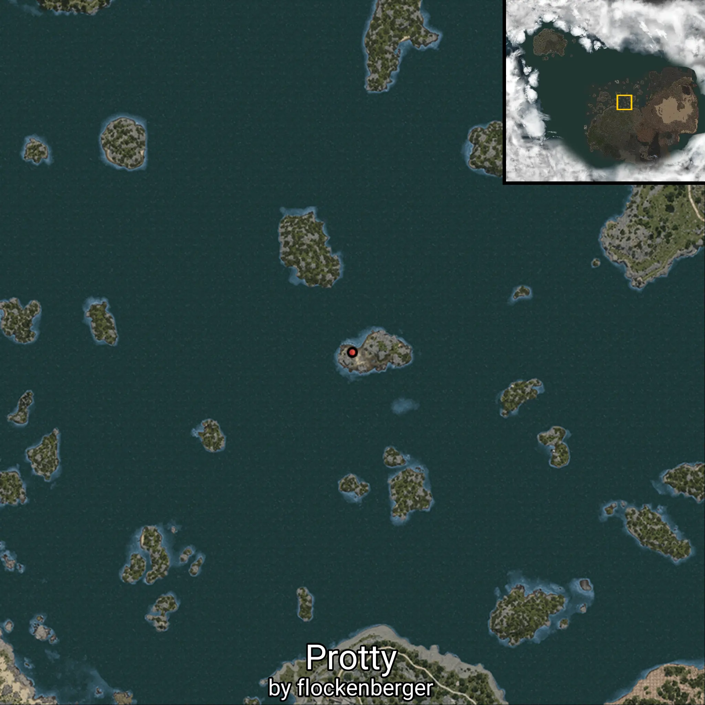

# Protties

This folder contains 6/7 waypoints of this knowledge category!

The following knowledge entries are currently missing: 

```
Sid Protty
```


Created by **flockenberger**

## ⚠️ Disclaimer:
The `WorldmapBookMark` XML block below may contain **more than 5 waypoints**.

**Please note that Black Desert Online only supports importing up to 5 waypoints at a time**.

Before importing, check and adjust which waypoints you want to use to avoid errors or missing data.

The waypoints are generated based on positions found in the client files and may not correspond to actual knowledge entries obtainable through NPC interactions.
They may instead point to locations such as mobs (monsters) or other entities that need to be defeated in order to gain knowledge.

## Waypoints
```xml
<!--
    Waypoints for: Protties
    Created by: flockenberger
-->
<WorldmapBookMark>
    <BookMark BookMarkName="Kaz Protty" PosX="31970.400390625" PosY="-16985.5" PosZ="242523.0" />
    <BookMark BookMarkName="Zera Protty" PosX="25327.19921875" PosY="-12942.900390625" PosZ="255259.0" />
    <BookMark BookMarkName="Protty" PosX="24258.599609375" PosY="-12952.0" PosZ="255156.0" />
    <BookMark BookMarkName="Protty Ootheca" PosX="25515.5" PosY="-12846.099609375" PosZ="255501.0" />
    <BookMark BookMarkName="Black Crystal Seaweed" PosX="24807.0" PosY="-13072.2998046875" PosZ="253656.0" />
    <BookMark BookMarkName="Ocean Crystal Seaweed" PosX="31462.30078125" PosY="-16935.69921875" PosZ="242438.0" />
</WorldmapBookMark>
```

      